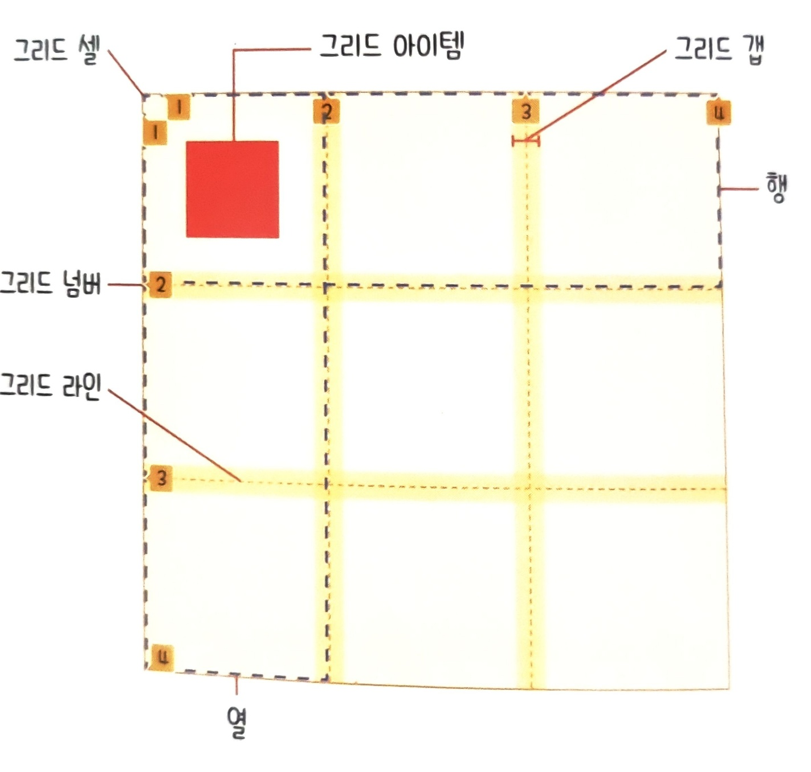

# 😱 Obsidian으로 정리하는중입니다.

[[Main]]

## 2. CSS
> CSS 관련 공부 기록입니다.

0. 문법 및 스타일 적용방법

- 형식

        선택자 { 속성 : 값; }

- 적용 방법
    - 내부 스타일 시트

            

    - 외부 스타일 시트

            <link rel="stylesheet href="파일경로.css">

    - 인라인 시트

            <태그 style="css 코드">

1. 선택자 사용

- 전체 선택자

        * {
            /* code */
        }

- 태그 선택자

        태그명 {
            /* code */
        }

- 아이디 선택자

        #id속성{
            /* code */
        }

- 클래스 선택자
        
        .class{
            /* code */
        }
    
- 기본 속성 선택자

        [속성=값]{
            /* code */
        }

        * 아이디, 태그 선택자와 함께 사용가능
        * 값에는 문자열이 올 수 있음

- 조합 선택자
    - 그룹 선택자

            선택자1, 선택자2, ... {
                /* code */
            }

    - 자식 선택자

            부모 선택자 > 자식 선택자 {
                /* code */
            }

    - 하위 선택자

            선택자1 선택자2 ... {
                /* code */
            }

    - 인접 형제 선택자

            이전 선택자 + 대상 선택자 {
                /* code */
            }

    - 일반 형제 선택자

            이전 선택자 ~ 대상 선택자 {
                /* code */
            }

- 가상 요소 선택자
    
            기준 선택자 :: 가상 요소 선택자 {
                /* code */
            }

    
    * 종류
        
            ::before : 콘텐츠 앞의 공간
            ::after : 콘텐츠 뒤의 공간

- 가상 클래스 선택자    
            
            기준 선택자 : 가상 클래스 선택자 {
                /* code */
            }
    * 종류
        - 링크

                :link : 한번도 방문하지 않은 링크일 때
                :visited : 한 번 이상 방문한 링크일 때
        - 동적
                
                :hover : 요소에 마우스를 올릴 때
                :active : 요소를 마우스로 클릭하는 동안
        - 입력

                :focus : 입력 요소(input, textarea)에 커서 활성화시
                :checked : 체크박스 표시될 경우
                :disabled : 상호작용 요소 비활성화시
                :enabled : 상호작용 요소 활성화시
        - 구조적 가상클래스

                E:first-child
                E:last-child
                
                E:nth-child(n) : E 요소가 부모 요소의 n번째 자식일 때
                E:nth-last-child(n) : E 요소가 부모 요소의 뒤에서부터 n번째 자식일 때
                
                E:first-of-type
                E:last-of-type

                E:nth-of-type : 부모 요소의 n번째 자식 요소
                E:nth-of-last-type : 부모 요소의 뒤에서부터 n번째 자식 요소

2. 특징

- 적용 우선순위
    
        기본 스타일 시트보다 사용자 정의 스타일이 우선
        단계적 적용(마지막 스타일만 적용)

- 개별성 규칙

| 선택자           | 예시 | 점수 |
|-----------------|------|-----|
| 전체 선택자      | * |0|
| 태그 선택자      | div, p, h1 |1|
| 가상 요소 선택자 | ::before |1|
| 클래스 선택자    | .box |10|
| 가상 클래스 선택자 | :hover |10|
| 아이디 선택자    | #title |100|
| 인라인 스타일    | style="color:red" | 1000 |
| !important      | color:blue !important; | 10000|

- 상속(inherit)

- 단위
    - 절대 단위

            px(pixel)

    - 상대 단위 

            - % : 상위 요소값의 상대적 크기
            - em : 부모요소 텍스트에 대한 상대적 크기
            - rem : html 태그에 대한 상대적 크기 
                [ html 텍스트 크기 = 16px = 1rem ]
            - vw : 뷰포트 너비에 대한 상대적 크기
            - vh : 뷰포트 높이에 대한 상대적 크기

- 색상
        
        - rgba (red, green, blue, alpha)
        - HEX #RRGGBB

3. 박스 모델 

 
  

- margin : 블록 외부 여백

        * 형식
        - margin-top/right/bottom/left
        - margin : <top> <right> <bottom> <left>
                   <top & bottom> <right & left>
                   < top & right & bottom & left>
        
        * margin collapse : 인접 margin 중 더 큰 값으로 통일
        * margin : auto 일 경우 뷰포트 기준 요소를 센터로 정렬

- border : 테두리

        * 형식
        - border : <width> <style> <color>
            <style>
                * none
                * hidden
                * solid
                * double
                * dotted
                * dashed
                * groove
                * ridge
                * inset
                * outset

- padding : 요소 내부 여백

        * margin 과 형식 동일

- content : 태그 사이에 작성된 내용
        
        * 형식
        - width / height

* width / height 특징

        박스 모델 내 콘텐츠가 없으면 width/height 제대로 적용 X

        웹 브라우저가 화면을 렌더링할 때 border + padding + content 영역의
        모든 너비와 높이를 종합적 계산하여 블록에 할당
        따라서 다음 속성을 사용

        - box-sizing : <속성>
            * 속성
                - content-box
                - border-box : border 너비/높이에 맞게 컨텐츠 영역 조절

* 박스 모델의 성격

        - 블록 : 항상 페이지의 모든 너비를 차지 (줄 바꿈)
            - 적용 가능 속성 : width/height, margin/padding
                * <hn>, 
, 

        - 인라인 : 너비를 콘텐츠 크기만큼 차지
            - 적용 가능 속성 : margin/padding 의 왼쪽,오른쪽 방향
                * <a>, , <strong>
        
        - 인라인 블록 : 너비를 콘텐츠 크기만큼 차지 + 블록의 성격(width/height 적용)
                * 

        * 다음 속성으로 변경 가능
        - display: <속성>
            * 속성
                - block
                - inline
                - inline-block

4. 속성

 
  

- 텍스트
    - 폰트

            - font-family : <글꼴1>, <글꼴 유형>
                * 글꼴 유형 : 글꼴을 불러오지 못 할 경우 텍스트가 해당 형태로 나타남 => 사용자 경험 유지
                    - serif
                    - sans-serif
                    - monospace
                    - fantasy
                    - cursive
            - font-size : <크기> [초기 값=16px]
            - font-weight : <굵기 숫자(100~900)> | <키워드>
                * 키워드
                    - lighther
                    - normal : 400
                    - bold : 700
                    - bolder
            - font-style : <글꼴 속성>
                * 속성
                    - normal
                    - italic : 이탤릭체
                    - oblique : 기울임꼴
            -font-variant : <속성>
                * 속성
                    - normal
                    - small-caps : 텍스트를 크기가 작은 대문자로 변환
    
    - 스타일

            - text-align : <속성>
                * 속성
                    - left / center / right
                    - justify : 양쪽 정렬(브라우저 크기에 맞춰 텍스트 사이 간격 늘림)
            - text-decoration : <속성>
                * 속성
                    - none
                    - line-through
                    - overline / underline
            - letter-spacing : <자간>
            - line-height : <텍스트 높이>

- 배경 (padding/content)
 
        -background-color : <색상값>
        -background-image : url('이미지 경로')
            * 반드시 배경 너비/높이 지정
            * 이미지 사이즈와 너비/높이가 다를 경우 잘리거나 반복됨
        -background-repeat : <속성>
            * 속성
                - no-repeat
                - repeat-x
                - repeat-y
                - repeat
                - round : 이미지 크기 자동 조절
                - space : 이미지 잘리지 않음
        -background-size : <속성>
            * 속성
                - auto : 이미지 크기 유지
                - cover : 이미지 종횡비 유지하며 크기 조절(배경 크기에 딱 맞게)
                - contain : 이미지 종횡비 유지하며 크기 조절
                            (가로 세로중 한 방향이 맞으면 멈춤, 못 채운 부분 반복)
                - 너비 높이
        -background-position : <x> <y>
            * 속성
                - <x> : left / center / right
                - <y> : top / center / bottom
                - px, %
        -background-attachment : <속성> 이미지 스크롤 형식
            * 속성
                - local : 웹 브라우저와 함께 스크롤
                - scroll : 요소 고정, 브라우저 스크롤
                - fixed : 요소, 브라우저 고정

- 위치
    
        - position : <속성>
            * 속성
                - static : 기본 흐름
                - relative : 기본 흐름 따라 배치하지만 좌표 속성 사용
                    * top / right / bottom / left
                - absolute : 절대 좌표 위치
                    * top / bottom 속성 미 지정시 원래 위치에서 x축으로만 이동
                    * 원래 요소의 공간을 빈 공간으로 인식
                - fixed : 뷰포트 기준 절대 좌표 위치
                - sticky : 일정 좌표까지 기본흐름 이후 fixed

        - z-index : <정수>
            * 나중 요소가 앞에 표시
            * 정수 값이 클 수록 위에 표시

5. 폰트 적용

- 텍스트 폰트

        - Google Font 등 웹 폰트를 제공하는 사이트에서 @import 하여 사용

- 아이콘 폰트

        - Font Awesome 등 아이콘을 제공하는 사이트에서 라이브러리를 다운받거나
          CDNJS 방식으로 연결 후 아이콘 <i class> 를 복사하여 HTML에 붙여넣음

6. 레이아웃

- float : 대상 요소를 공중에 띄움(인라인 성격), 대상의 위치를 빈 공간으로 인식

        - float : <속성>
            * 속성
                - none
                - left / right
            * width 미 지정시 콘텐츠 만큼 너비 조절
            * float 으로 지정된 자식 요소는 부모 요소가 인식 X
        
        - clear : <속성> => 이전 요소의 float 속성 해제
            * 속성
                - left / right / both
            * 부모 요소가 float 자식 요소를 인식하는 법
                .container::after{
                    content: "";
                    display: block;
                    clear: both;
                }

- flex : 1차원 방식 레이아웃
    - flex layout

            - display : flex

                * flex 선언된 블록 컨텐츠의 정렬은 다음과 같음
                    - justify-content: center (row)
                    - align-items: center (column)
                    * flex 아닌 경우 -> margin : auto 등으로 적용가능
                    * flex 는 1 줄에 몇 개의 content 가 오는 것을 정의 X
            - flex-direction : <속성>
                * 속성
                    - row : 왼쪽 -> 오른쪽
                    - reow-reverse : 오른쪽 -> 왼쪽
                    - column : 위 -> 아래
                    - coloumn-reverse : 아래 -> 위
            - flex-wrap : <속성> -> 플렉스 아이템이 컨테이너를 벗어날 경우
                * 속성
                    - nowrap : 무시(컨테이너 뚫고 나감)
                    - wrap : 영역을 벗어나면 줄 바꿈
                    - wrap-reverse : wrap의 역 방향으로 줄 바꿈(기본 값일 때 위로 줄이 올라감)
            - flex-flow : <direction> <wrap>
    
    - flex layout 정렬

            - justify-content : <속성> -> 주 축 방향 정렬(row)
                * 속성
                    - flex-start : 주축 방향 시작
                    - flex-end : 주축 방향 끝
                    - center : 중앙
                    - space-between : 플렉스 아이템 간격 균일(양 끝 간격 X)
                    - space-around : 플렉스 아이템 둘레 균일 (한 아이템 양쪽 둘레 균일)
                    - space-evenly : 플렉스 아이템 사이와 양 끝 간격 균일 (IE, edge 동작 X)

            - align-items : <속성> -> 교차 축 방향 정렬 (column)
                * 속성
                    - stretch : 교차축 방향 아이템 너비/높이가 블록 크기에 맞게 확대
                    - flex-start 
                    - flex-end
                    - center
                    - baseline
            - align-content : <속성> -> wrap 속성으로 2줄 이상일 때 사용
            - align-self : <속성> -> 단일 정렬

- grid : 2차원 방식 레이아웃 ( row / column 같이 사용 )

- grid layout

        - display : grid
            * 해당 속성 지정 요소가 그리드 컨테이너
        
        - grid-template-columns : <1열값> <2열값> ...
        - grid-template-rows : <1행값> <2행값> ...
            * 값으로 행/열의 크기 결정
            * repeat(), minmax() 함수 사용 가능

        - row-gap : <크기>
        - column-gap : <크기>

- grid 정렬

        - align-items : <속성> -> Y축 정렬
            * 속성
                - stretch
                - start
                - center
                - end
        - align-self

        - justify-items : <속성> -> X축 정렬
        - justify-self

        - place-items : <align-items> <justify-items>
        - place-self : <align-self> <justify-self>

- grid 배치

        - grid-template-areas : <이름>
            * 이름 예시
                "header header header"
                "sidebar content content"
                "footer footer footer"
        - grid-area : <행/열 이름>
            * grid-template-area 로 정한 이름을 부여
            * 코드 예시
                #header {
                    grid-area : header
                }

- grid 아이템 배치 

        - grid-column-start : <start grid number>
        - grid-column-end : <end grid number>
            * 그리드 넘버로 구분

        - grid-row-start
        - grid-row-end

        - grid-column : <start> <end> || <start>/span <열 개수>
        - grid-row : <start> <end> || <start>/span <행 개수>

7. 전환 효과

- Transition : 가상 클래스 선택자 등에 의해 기존 속성 값이 변경

        - transition-property : <속성 값> -> 전환 효과
            * 속성
                - none
                - all
            * 전환 가능한 속성이 정해져 있음
        - transition-duration : <시간> -> 전환 효과 지속 시간
        - transition-delay : <지연 시간>
        - transition-timing-function : <속성> -> 전환 효과의 진행 속도
            * 속성
                - linear : 일정
                - ease : 빨라지다가 느려짐
                - ease-in : 느리다가 점점 빨라짐
                - ease-out : 빠르다가 점점 느려짐
                - ease-in-out : 느리다가 빨라졌다가 느려짐
                - cubic-bezier : 사용자 정의 속도
                    * 개발자 도구에서 속도 조절

8. 애니메이션

- @keyframes 정의하여 실행

        - @keyframes <키 프레임명>{
            0%{ /* 시작 코드 */ }
            n%{}
            100%{ /* 종료 코드 */ }
            }

        - @keyframes <키 프레임명>{ 
            from{ /* 시작 코드 */ }
            to{ /* 종료 코드 */ }
            }

- 키 프레임명 지정 및 속성

        - animation-name : <키 프레임명>
        - animation-duration : <지속 시간>
            * 키 프레임, 애니메이션 네임, 듀레이션은 필수 (없으면 동작 X)
        - animation-delay : <지연 시간>
        - animation-fill-mode : <속성> -> 애니메이션 종료 시점의 상태 설정
            * 속성
                - none : 
                    실행 전 : 시작 지점 스타일 적용X 대기
                    실행 후 : 실행 전 스타일 적용 상태로 돌아감
                - forwards :
                    실행 전 : 시작 지점 스타일 적용X 대기
                    실행 후 : 종료 지점 스타일 적용 상태로 대기
                - backwards
                    실행 전 : 시작 지점 스타일 적용O 대기
                    실행 후 : 실행 전 스타일 적용 상태로 돌아감
                - both
                    실행 전 : 시작 지점 스타일 적용O 대기
                    실행 후 : 종료 지점 스타일 적용 상태로 대기
        - animation-play-state : <속성> -> 애니메이션 재생 상태 지정 (실행 도중 조작 가능 with JS)
            * 속성
                - paused
                - running
        - animation-diretion : <속성> -> 진행 방향
            * 속성
                - normal : 키 프레임 정의 순서(from -> to)
                - reverse
                - alternate : 홀수 번째 normal, 짝수 번째 reverse
                - alternate-reverse : 홀수 번째 reverse, 짝수 번째 normal
        - animation-timing-function

9. 변형 효과

- 요소의 크기 변경, 위치 이동, 회전

        - transform : <함수>
            * 함수
                - translate(x,y) : 현 위치에서 x, y 축 만큼 이동
                - translateX(n)
                - translateY(n)

                - scale(x,y) : x, y 축 만큼 확대/축소
                - scaleX(n)
                - scaleY(n)

                - skew(xdeg, ydeg) : x, y 각도 만큼 기울임
                - skewX(deg)
                - skewY(deg)

                - rotate(deg) : deg 만큼 회전
                    * deg > 0 -> 시계방향 회전
                    * deg < 0 -> 반시계방향 회전

- 기준점 변경

        - transform-origin : <x> <y> -> 변형 기준점 변경
            * 속성
                - x : left / center / right
                - y : top / center / bottom

10. 미디어 쿼리

- 반응형 웹(responsive web)을 만드는 주요 기술

        사이트에 접속하는 미디어 타입, 특징, 해상도에 따라 다른 스타일 속성을 적용하는 기술

- 뷰포트(viewport) : 웹 페이지가 접속한 기기에서 보이는 실제 영역 크기

        * HTML 문서는 어떤 기기에서 접속하더라도 980px 크기 기준으로 보여줌
          따라서 HTML의 metadata 를 설정해야 함
          <meta 
          name="viewport
          content="width=device-width,
          initial-scal=1.0">
        
        * 메타 content 속성 값
            - width / height
            - initial-scale : 초기 배율
            - minimum-scale : 최소 축소 비율 [ 기본값 = 0.25 ]
            - maximum-scale : 최대 확대 비율 [ 기본값 = 5.0 ]
            - user-scalable : 뷰포트 확대/축소 여부 ( yes || no )

- 미디어 쿼리 문법

        @media 
        < not | only >  
            - not : 뒤의 모든 조건 부정
            - only : 미디어 쿼리 지원 기기만 해석
        < mediatype > : 미디어 타입
            - all : 모든 기기 ( 기본 값 )
            - print : 인쇄 장치
            - screen : 컴퓨터 화면 장치, 스마트 기기
            - speech : 스크린 리더기, 보조 프로그램
        and  : mediatype 생략하지 않으면 다음에 and 연산자 필수
        ( <media feature> ) : 미디어 조건
            - min-width : 미디어 쿼리 적용 하한값( 최소 너비 ~ )
            - max-width : 미디어 쿼리 적용 상한값( ~ 최대 너비 )
            - orientation :
                * portrait : 세로모드, 세로 높이 > 가로 너비
                * landscape : 가로모드, 가로 너비 > 세로 높이
        < and | or | not > 
        ( <media feature> ) {
            /* CSS 코드 */
        }

## 3. JavaScript
> JavaScript 공부 기록입니다.

0. JavaScript 란 무엇인가

    
- JavaScript 

        웹 페이지에서 복잡한 기능을 구현할 수 있도록 하는 스크립팅 언어
        동적으로 콘텐츠를 바꾸고, 멀티미디어를 제어하고, 애니메이션을 추가 가능
        
        자바 스크립트 엔진 (가상머신) 이 내장된 프로그램이 실행 가능
	    엔진이 스크립트를 읽고(파싱) 기계어 전환(컴파일)

        * 자바스크립트 엔진 종류
	        - Chrome / Opera - V8
	        - SpiderMonkey - Firefox
	        - ChakraCore - Microsoft Edge
	        - SqulrrelFIsh - Safari

        자바스크립트는 인터프리터를 사용
        모던 자바스크립트는 JIT 컴파일 기술을 사용하여 성능 향상
        수정하려는 HTML, CSS 보다 자바스크립트가 먼저 불러와질경우 오류 발생
        스크립트를 별도의 파일로 저장할 경우 브라우저가 스크립트를 다운받아 캐시로 저장 -> 성능 향상, 트래픽 절약

- 특징

	    - 스크립트 tag 내에 src 속성이 있으면 태그 내부의 코드는 무시

	    - 줄바꿈시 세미콜론 자동 삽입 그러나 대괄호 [] 앞 등에는 세미콜론 자동삽입 X -> 세미콜론 사용 권장

        - 엄격모드 : 
                ES5에서 기존 기능 일부 변경되며 하위 호환성 문제 발생
                기본 모드에서는 변경사항 대부분 비활성화, 엄격모드 사용시 변경사항 활성화

                * 모던 자바스크립트는 클래스/모듈을 제공
                -> 엄격모드가 자동 적용	

                * 사용법
                    use strict
                    
                    * 스크립트 최상단 또는 함수 본문 맨 앞에 올 수 있음
                    * 함수 내에 위치시 해당 함수만 적용

- 제약 사항

    	특정 조건이 아닐 경우 디스크에 저장된 파일을 읽지 못함
	    => 동동일 출처 정책(SOP, Same Origin Policy)

- ECMA-262 명세서
    >https://www.ecma-international.org/publications-and-standards/standards/ecma-262/

- 호환성
    >http://caniuse.com

- API

        Application Programming Interface

        개발자가 직접 구현하기는 어렵거나 불가능한 기능들을 미리 만들어서 
        클라이언트 사이드 자바스크립트에 제공하는 것

    - 3rd party APIs
        - Twitter API
        - Google 지도 API
    - Brouser API
        - DOM API 
        
                HTML 콘텐츠를 추가, 제거, 변경하고, 동적으로 페이지에 스타일을 추가하는 등 
                HTML/CSS를 조작하는 API

        - Geolocation API

                지리 정보 API

        - Canvas / WebGL API

                2D, 3D 애니메이션 그래픽

        - HTMLMediaElement / WebRTC 
        
                오디오, 비디오 API

- 브라우저 보안

        각각의 브라우저 탭은 코드를 실행하기 위한 독립적인 그릇
        따라서 각각의 탭은 분리되어 다른 사이트에 직접적인 영향을 주기 어려움

- Server Side vs Client Side

    - Server Side Code 

            서버에서 실행 결과를 처리하여 브라우저가 이를 다운로드하여 화면에 출력
            자바스크립트는 Node.js 환경에서 서버 사이드 언어로 사용 가능

    - Client Side Code

            사용자의 컴퓨터에서 코드를 처리하고 브라우저가 실행하는 코드
            자바스크립트는 React 환경에서 클라이언트 사이드 코드로 동작

- 가비지 컬렉션
        
        자바스크립트는 도달가능성(reachbility) 개념을 사용하여 메모리 관리 수행, 도달할 수 없는 값은 가비지 컬렉터가 삭제
        Root<global> 에서 시작해서 도달할 수 없는 경우 삭제 (외부로 나가는 참조는 영향X)

	
	* mark and sweep 알고리즘

            가비지 컬렉터가 루트 정보를 수집하고 mark(기억)
            루트가 참조하는 모든 객체와 그 객체들이 참조하는 객체 모두들 mark
            mark된 객체는 방문하지 않고 모든 객체를 방문할때까지 반복
            makr 되지 않은 객체는 메모리에서 삭제

	* 가비지 컬렉터 최적화 기법

            - 세대별 수집(generational collection) 
            - 점진적 수집(incremental collection) : 작업분리
            - 유휴시간 수집(idle-time collection) : CPU 유후상태일때만 실행

        [V8 Garbage-Collection](https://jayconrod.com/posts/55/a-tour-of-v8-garbage-collection)

- 디버깅

        chrome 개발자도구 source 탭 활용
        
        * debugger => breakpoint 설정

- 테스트 자동화 
 
	- BDD(Behavior Driven Development) : 테스트, 문서, 예시를 한데 모아놓은 개념
        
    - 관련 라이브러리

            Mocha : 테스트 프레임워크(describe, it 등 테스팅 함수 제공)
            Chai : 다양한 assertion 제공
            Sinon : 함수의 정보 제공

    * 예시

            describe( "함수이름", function() ) {
                it("유스케이스 설명", function(){
                    assert.equal(함수이름(인수), value2) -> 함수 반환값과 value2가 같으면 에러 없이 실행
                });
                ...
            }

            * describe 는 중첩하여 사용가능		
            * it.only() 사용하면 해당 블록만 테스트		

            - before ( ) : 테스트 시작 전 괄호 안 내용 실행
            - after ( ) :
            
            - beforeEach ( ) : 매 it이 실행전 실행
            - afterEach ( ) :

- 바벨, 폴리필

        바벨 :  트랜스파일러 => 모던 자바스크립트를 구 표준을 준수하는 코드로 변환
	        * Webpack 은 자동으로 트랜스파일러 동작

        폴리필 :  브라우저가 지원하지 않는 자바스크립트 코드를 지원 가능하도록 변환한 스크립트
            - core js
            - polyfill.io

<!-- API/보안 정보는 나중에 추가로 공부할 것 -->
<!-- 간략한 내용들 추가 작성 필요 -->

1. JavaScript 연결 방법

- 내부 스크립트

        HTML 파일 내에서 
            ->
                async : 
                    스크립트를 가져오는 동안 페이지 로딩을 중단하지 않음
                    스크립트 다운로드가 끝나면 바로 스크립트가 실행되며 실행 도중에는 페이지 렌더링이 중단
                    스크립트의 실행 순서를 보장할 방법은 없음 
                    따라서 async는 다른 스크립트에 의존하지 않는 독립 스크립트에 사용 가능
                    * 다수의 백그라운드 스크립트를 최대한 빠르게 불러와야 할 때 사용

                defer :
                    페이지 내에 배치한 순서대로 페이지를 부르며 
                    페이지 콘텐츠를 모두 불러오기 전까지는 자바스크립트를 실행하지 않음
                    페이지 요소를 수정하거나 추가하는 등 DOM 작업을 기대하는 스크립트에 유용
                    * 스크립트 순서를 맞출 경우 효과적인 방법
        
        3. 브라우저 DOMcontentLoaded 이벤트 수신
            * 예시
                document.addEventListener('DOMContentLoaded', () => {
                    ...
                });

2. 변수와 상수

- 변수(Variant)
    - 문법

            키워드(keyword) : 역할이나 기능이 정해진 단어[=예약어(reserved word)]
            식별자(identifier) : 자바스크립트 변수, 함수 등에 부여되는 이름
                * var, let, const 와 함께 사용시 변수명
                * 식별자 규칙
                    키워드는 식별자로 사용할 수 없음
                    첫 글자는 영무 소문자, 언더바, $ 만 가능
                * 관용 규칙
                    변수명 : 카멜 표기법
                    함수명 : 파스칼 표기법
                
            연산자(operator) : 연산작업 기호
            표현식(expression) : 평가(evaluation)되어 하나의 값(value)을 만드는 식
            값(value) : 더 이상 평가할 수 없는 데이터
            세미콜론(semicolon) : 하나의 문법(statement)이 끝났음을 의미
    
    - 변수 선언 키워드
        
            - var
            - let : ES6에서 추가된 키워드
                ->
                    * 변수명 중복 불가능
                    * 호이스팅(Hoisting)되지 않음
                        * 호이스팅 : 
                            var 키워드로 변수 선언, 할당시 변수 선언을 자바스크립트의 스코프(scope) 맨 위로 올려 실행
                    * 일부 브라우저 지원 X

- 상수(Constant)

    - 상수 선언 키워드

            - const : ES6에서 추가된 키워드, 선언 뒤 재할당 불가
    
    

3. 자료형

> 동적 타입 언어 : 변수에 저장되는 값의 타입을 언제든지 변경 가능

- 기본 자료형(Primitive)
    
    - 문자열(String) : 따옴표( " 또는 ' )로 둘러싸인 값

            - + : 문자열 연결 연산자
                * 예시
                    let string = "문자열" + "더하기";
            - 이스케이프 문자열 :
                - \' : 작은 따옴표
                - \" : 큰 따옴표
                - \n : 줄바꿈
                - \ㅅ : 수평 탭
                - \\ : 역슬래시
            - 템플릿 문자열 : ES6에서 추가된 방식, 백 틱(``)으로 문자열 정의
                * 특징
                    - Enter시 줄 바꿈 적용
                    - ${} 문법을 이용해 문자열에 변수, 식 삽입 가능
            - 인덱스 [] 로 문자열 찾기 가능

        - 문자열 메소드 : 문자열도 객체이므로 메소드, 속성 사용 가능

                - length : 문자열 길이
                - indexof("문자열") : 문자열 해당 인덱스, 못 찾으면 -1 반환
                - slice(start index,end index) : 슬라이싱
                - toLowerCase() : 대문자로 변경
                - toUpperCase() : 소문자로 변경
                - replace("바꿀 문자열","바뀔 문자열")
                - split("자를 문자열") : 문자열을 자를 문자열 기준으로 나누어 배열로 저장

                * 문자열 비교시 우선 유니코드 기준으로 비교, 또는 문자열의 길이가 큰 쪽을 크다고 지정
    
    - 숫자형(number) : 자바스크립트는 정수, 실수를 구분하지 않고 하나의 숫자형으로 취급

            자바스크립트는 수학 연산시 에러를 발생하지 않음
                - Infinity, -Infinity : 무한대
                - NaN : 계산 중 오류

            * 실수를 부동 소수점 방식으로 처리하는 것은 동일

    - BigInt : (2^53-1)보다 큰 수, 또는 -(2^53-1)보다 작은 수
		
		    * 정수 끝에 n을 붙이면 BigInt 자료형

    - 논리형(boolean) : ture, false

    - undefined : 메모리에 데이터가 할당되지 않은 경우의 임시 데이터

    - null : 의도적으로 메모리에 공간을 비워 둠

    - 심볼(symnbol) : 유일한 식별자를 만들 때 사용

            심볼은 유일성을 보장, 심볼의 설명은 영향을 주지 않는 이름표의 역할

            * 심볼은 문자형으로 자동 형 변환 X

            - 사용법
                let id = Symbol("id");
                let user = {
                    name: "John",
                    [id]: 123 // "id": 123은 안됨
                };
                
                -> id는 "id"라는 설명이 붙은 심볼, 대괄호를 통해 심볼으로 프로퍼티 생성 가능
            
        * 심볼형 프로퍼티 숨기기 원칙(hiding symbolic perperty)

                키가 심볼인 프로퍼티는 for ..in 반복문에서 배제
                외부 스크립트/라이브러리는 심볼형 키를 가진 프로퍼티에 접근 X
                단 Object.assign 으로 객체 복사시 심볼 프로퍼티도 함께 복사

        - 전역 심볼 레지스트리(Global Symbol Registry) : 이름이 같은 심볼 객체에 접근 가능

                * 예시
                    let id = Symbol.for("id"); // id 인 심볼이 없으면 생성(전역 심볼)
                    let id2 = Symbol.for("id"); // id 인 심볼 접근
                    alert(id == id2); // true

        - 심볼 메서드
        
                - Symbol.decription : 심볼의 이름 출력
                - Symbol.for(key) : 이름이 key인 심볼을 찾음(없으면 생성)
                - Symbol.keyFor(sym) : 심볼 sym의 이름을 찾음(전역심볼이 아니면 undefined)

- 참조 자료형(Reference)
    
    - 객체(object)
        
        - 배열(array) : 복수의 데이터 정의, 인덱스로 접근 가능
            
                * 모든 자료형을 정의 가능

                * 예시
                    let array = ['abc',10,true,null,[],{},function()];

            - 배열 메소드 

                    - length
                    - join("붙일 문자열") : 배열을 문자열로 저장
                    - toString : 배열을 문자열로 저장(항상 "," 사용)
                    - push() : 배열 끝에 원소 추가
                    - pop() : 배열 끝에 원소 제거
                    - unshift() : 배열 앞에 원소 추가
                    - shift() : 배열 앞에 원소 제거

        - 객체 리터럴 : Key,Value 의 한 쌍으로 이루어진 속성(Property)로 이루어짐, 중괄호 {} 사용
        
                * Key 인덱스 및 마침표(.)로 Value에 접근 가능

                * 예시
                    let score={
                        korean:80;
                        english:90;
                    };

                    console.log(score.korean);
                    console.log(score['korean']);

        - 함수(function)

- typeof(변수명)

        변수의 자료형 확인 가능한 메소드
    
        * typeof null => object //하위 호환성을 위한 언어 자체의 오류
        * typeof alert => function //함수형이란건 존재하지 않지만 규칙에 의해 function으로 출력

* 자료형 변환 예시

    * 숫자형-문자형 변환

            - alert -> 전달받은 모든 값을 문자열로 자동 변환
            - 수학 관련 표현식( 나누기 등)에서 문자열은 숫자형으로 변환
                -> 단 이항 연산자 + 사용시 피연산자 중 하나라도 문자열이면 모두 문자열로 변환
		
            * 예시
                "" +1+0 => "10"
                "" -1+0 => -1
                "  -9  " + 5 => "  -9  5"
                "  -9  " - 5 => -14
                " \t \t " - 2 => -2 //공백 제거

    		- 단항 연산자 + 와 숫자가 아닌 피연산자 사용시 명시적 숫자형 변환 ( Number()와 같음 )
		
            * 예시
                let apples = "2";
                let oranges = "3";
                alert( +apples + +oranges ); // 5

                let a = +prompt("덧셈할 첫 번째 숫자를 입력해주세요.", 1);
                let b = +prompt("덧셈할 두 번째 숫자를 입력해주세요.", 2);
                alert(a + b); // 3

	* 명시적 숫자형 변환

            - undefined => NaN
            - null => 0
            - true/false => 1/0
            - 문자열 => 처음/끝 공백 제거, 제거후 문자열 없으면 0, 숫자가 아닌 값을 변환하려하면 NaN 출력 
            
            * 예시
                    Number("숫자가아닌 값") 	
        
	* 명시적 Boolean 형 변환

            - 0, null, undefined, NaN, "" => false
            - "0", " ", 그 외 값 => true  

    * 객체의 자동 형 변환

            객체 논리 평가시 true 반환 => 객체는 숫자형 또는 문자형으로만 변환
            
            - 문자열 변환 : alert(), +
            - 숫자형 변환 : ==, +, >, -, ...

            - 형 변환 알고리즘
                1. 객체에 obj[Symbol.toPrimitive](hint)메서드가 있는지 찾고, 있다면 메서드를 호출
                    * Symbol.toPrimitive : 목표 자료형 명명
                    * hint : "String", "number", "default"
                        -> obj.toString() 또는 obj.valueOf() 호출
                            - toString() : 문자열 "[objcet Objcet]" 반환
                            - valueOf() : 객체 자신 반환
                    => 단, 명시된 자료형으로의 형 변환을 보장하지 않음(객체가 아닌 원시값을 반환하는 것은 보장)

                2. 메서드가 없다면 hint를 참조

            * 예시
                let user = {
                    name: "John",
                    money: 1000,
                    // hint가 "string"인 경우
                    toString() {
                        return `{name: "${this.name}"}`;
                    },
                    // hint가 "number"나 "default"인 경우
                    valueOf() {
                        return this.money;
                    }
                };
                alert(user); // toString -> {name: "John"}
                alert(+user); // valueOf -> 1000
                alert(user + 500); // valueOf -> 1500

4. 연산자

- 연산자(operator)
    - 산술 연산자 

            이항 산술 : +, -, *, /, &, **
            단항 산술 : ++, --
            단항 부정 : -
    
    - 대입 연산자

            대입 : =
            복합 대입 : +=, -=, *=, /=, %=, **=

    - 비교 연산자 : true / false 반환

            ==, !=, <, <=, >, >=

            * 자바스크립트 연산자 비교

                1. 동등( ==, != ) vs 일치( ===, !== ) :
                    동등 연산자 : 자료형에 상관없이 값이 같으면 true 반환
                    일치 연산자 : 자료형과 값이 모두 같으면 true 반환

                * null 과 undefined 는 커플 취급
                    null == undefined // true 
                    null === undefined // false
                    null == 0 // false 
                    => null / undefined 은 동등비교(==)시 형 변환 X
	
	            * null / undefined 비교(<,>,>=,<=)시 형 변환
                    null => 0
                    undefined => NaN
                    
    - 논리 연산자

            &&, ||, !

            * 빈 문자열(""), undefined, null, 0 는 false

            	OR :
                    단락 평가 : truthy 를 만나면 나머지 값을 검사 하지 않음(첫 번째 true 피연산자 반환)

                    * 예시
                        alert( alert(1) || 2 || alert(3) );
                        => alert(1)을 우선 평가(undefined, 1 출력) => 2를 평가(true) 및 2 출력 => alert(3)는 실행 X
                
                AND :
                    모든 값을 평가하여 true 일 경우 마지막 피연산자 반환

                NOT :
                    두 번 연달아 사용하여(!!) Boolean 형변환 가능

                    * 예시
                        !!"1" => !false => true

		
		* 예시
			true || alert("not printed"); -> alert 실행 X
			false || alert("printed"); -> alert 실행 O

    - 삼항 연산자

            x ? y : z

            * 삼항 연산자 ? 뒤에 break/continue 올 수 없음

    - 병합 연산자 (??, nullish)
	
            최근 추가된 문법, 구식 브라우저 폴리필* 필요
        
            * 안정성 이슈로 &&, || 와 함께 사용 X (Syntax error 발생)
                -> 괄호를 사용하여 제약 회피	

            * 예시
                a ?? b -> a가 null/undefined 이 아니면 a 맞으면 b

- 연산자 우선 순위

        1. 그룹 연산자 ()
        2. 대괄호 연산자 []
        3. 마침표 연산자 .
        4. 증/감 연산자 ++, --
        5. 단항 부정 연산자, NOT 연산자 -, !
        6. delete,new,typeof
        7. /, *, %
        8. +, -
        9. <=, <, >, >=
        10. ==, ===, !=, !==
        11. &&, ||
        12. 삼항 연산자 ?:
        13. 대입 연산자 =

- 형 변환
    - 암시적 : 자바스크립트에서 자체적으로 형 변환

            * 예시
                1.
                    const result = 10 + "10" 일 때 result === 1010
                    -> 숫자형 데이터를 문자열 데이터로 형 변환
                2.
                    심볼 제외한 모든 값은 alert() 내에서 문자열로 변환

    - 명시적 : 캐스팅

            * 예시
                let num = 10;
                let strNum = "10";

                if( String(num) == strNum){
                    // true 
                }
       

5. 조건문

- if, else, else if

        if(statement){
            ...
        }
        ...

- switch

        switch(key){
            case value : ... 
                break;
            ...
            default : 
                break;
        }

6. 반복문

- while 

        while(statement){
            ...
        }

- do while

        do{
            ...
        }while(statemnet)

- for
     - default :

                for ( 초깃값 ; 조건식 ; 증감식){
                    ...
                }

    - for ... in :

                for ( 가변수 in 배열/객체 리터럴){
                    ...
                }
                
                * 객체 리터럴의 key를 할당

    - forEach :

                배열.forEach(item, idx)

                * 배열의 요소, 인덱스에 접근
                * 중간에 루프 탈출 X
    
    - for ... of :

                for ( 가변수 of 이터러블 객체 ){
                    ...
                }

                * ES6에서 추가된 기능
                * entries() 메소드를 통해 인덱스, 값에 동시 접근 가능

- break / continue

- label

        레이블(label) : 반복문 앞에 쓰이는 식별자 break/continue와 함께 사용가능

        * 예시
            labelName: for(...){
                ...
                for(...){
                    ...	
                    break labelName; -> 2개의 for 문을 모두 빠져나옴
                }
            }

7. 함수

- 함수 정의 방법
    - 함수 선언문(function declaration statement)

            function 식별자(매개변수 [= 기본값]) {
                ...
            }

            * 호출시 -> 식별자();

    - 함수 호출

            식별자(인수)

            * 인수가 없으면 undefined 할당
		    * 인수로 undefined 할당시 기본 값 할당

            * 함수는 값으로 취급 -> 함수 이름을 alert의 인수로 할당할 경우 해당 함수의 소스 코드가 출력
                - let 변수 = 함수 이름; => 함수 복사
                - let 변수 = 함수 이름(); => 함수 반환값 할당

    - 함수 표현식(function expression)
        - 익명 함수
                
                const 변수명 = function() {
                    ...
                };
        
        - 네이밍 함수

                const 변수명 = function 식별자(){
                    ...
                };
                
                * 함수 표현식으로 함수 정의시 변수명으로 함수 호출하지 않으면 ReferenceError 발생

    - 화살표 함수(arrow function) 

                () => {
                    ...
                };

                * ES6에서 추가된 함수 정의 방법
                * 익명 함수로만 정의 가능 따라서 함수 표현식과 함께 사용하여 변수에 할당
                * 매개 변수가 1개일 경우 () 생략 가능, => 다음 식이 return 문

    - 콜백 함수(called back)
	        
            함수를 값처럼 전달, 함수를 함수의 인수로 전달하여 그 함수를 나중에 호출

- 매개 변수(parameter)와 인수(argument)
    
        - 매개 변수를 정의하고 값을 할당하지 않으면 undefined 값이 할당 ( 오류 발생 X )
        - 매개 변수가 없는데 인수를 전달할 경우에도 오류 발생 X
        - 매개 변수에 기본 값 할당 가능
            * 예시
                function sum(a=10, b=10){
                    ...
                }

- 반환값 : 

		return 이 없거나 return 만 있을 경우 undefined 반환

		* 자바스크립트는 return 문 끝에 세미콜론을 자동으로 삽입
		  (return 과 값 사이에 줄 삽입 X -> 괄호 사용 O)

- 스코프(scope) : 변수/ 함수 같은 참조 대상 식별자를 찾아내는 규칙
    - 함수 스코프 :
		
            함수 내부 : 지역 스코프(함수 내에서 정의한 블록문만 유효 범위로 인정)
 					    -> 밖에서 정의한 변수가 함수 내부에서 사용가능

		    함수 외부 : 전역 스코프(스코프와 상관 없이 모두 참조)
					    -> 함수 내에서 정의한 변수 밖에서 사용 불가능
	
	- 블록 스코프 :
		
            ES6에서 추가된 let, const 키워드 변수에 한해서만 적용
		    var 변수는 블록 {}에 영향을 받지 않음
		
            * 예시
                var a = 10 ;
                {
                    var b = 20;
                }
                console.log(a,b) // b 값이 제대로 출력

	* 참조 우선순위 :

            let, const는 같은 스코프 영역에서 중복 선언이 불가능
            
            1. 코드 내에서 같은 식별자로 중복 선언시 같은 지역 스코프의 식별자를 우선 참조
            2. 찾지 못할 경우 전역 스코프에서 참조

- 함수 호이스팅(hoisting) :

        - 코드를 선언과 할당으로 분리해 선언부만 자신의 스코프 최상위로 올림
        * var, 함수 선언문에 적용(함수 표현식으로 정의될 경우 함수 식별자만 올림)
        * let, const에는 적용 X	

	    * 예시
            console.log(num);			var num;
            var num = 10;		=>	console.log(num)	//undefined
                            num = 10;	

- 즉시 실행 함수(IIFE, immediately invoked function expression) :
	
        일반적인 함수는 전역 스코프에 정의되어 프로그램이 종료될 때까지 메모리에서 사라지지 않음
        한 번만 사용할 함수의 경우 전역스코프의 오염이 발생	
        -> IIFE는 함수를 정의하면서 동시에 실행되고 메모리에 데이터를 남기지 않음
        
        * 예시
            ( function(){} )();

- 생성자 함수(constructor) 
	
        new 연산자를 붙여 실행, 함수 첫 글자는 대문자
        빈 객체를 만들고 this에 할당, this 에 프로퍼티/메서드 추가후 반환
        ( this = {};	=> this.name = name;	=> return this; )

        * 예시
            let user = new User(); ( 인수가 없으면 괄호 생략 가능 )

        - 익명 생성자 함수 : 한번만 사용될 객체를 호출 후 저장 X (재사용X)

            * 예시
                let user = new function(){
                    this.name = "jonh";
                    ...
                };

	    - 생성자 return : return으로 객체가 오면 this 무시, 해당 객체 반환. 그 외엔 this 반환

	    - new.target 메서드 : 함수 호출시 new 를 붙였는지 true/false 체크

8. 객체

- 객체

        Key 와 Value 로 구성된 속성의 집합
        리터럴 {} 방식으로 객체를 생성 가능
        * 메서드 : 객체 내에서 함수가 속성의 값일 때 함수를 지칭

        * 선언 예시

            const 객체이름(user) = {
                key : value,
                name : james
                ...
                (property),
            }

        * 마지막 프로퍼티 끝에 쉼표 올 수 있음
        * 프로퍼티 키 이름엔 제약사항이 없음(for,let,return..)
          (문자/심볼형이 아닌 키 값은 문자열로 자동 형 변환)

        * 특별 키 이름
            __proto__ 

- 메서드
	    
        	객체 내 메서드 선언시 function 생략 가능

            * 예시
                user = {
                    sayHi() { // "sayHi: function()"과 동일.
                            alert("Hello");
                    }
                };
	
	- this : 키워드를 사용하여 객체에 접근가능(객체 내 메서드에서 객체를 호출 가능)

            * 모든 함수에 사용가능, this는 런타임에 결정( . 앞의 객체를 참조 )
            * 객체 없이도 호출가능 ( 엄격모드일 경우 this == undefined )
              (엄격 모드가 아닐경우 this가 전역 객체(window)를 참조)
            * 화살표 함수 내에서 this는 외부 컨텍스트를 참조 ( 자신의 this 없음 )
            * this 값은 호출시점에 결정

		    * this 예시

                1. 
                    function makeUser() {
                        return {
                                name: "John",
                                ref: this
                        };
                    };
                    let user = makeUser();
                    alert( user.ref.name ); // Error: Cannot read property 'name' of undefined

                    -> this 호출시 undefined 로 결정
                       this가 함수로 호출, ref: this 는 현재 this의 값(undefined)
                    
                2.
                    function makeUser() {
                        return {
                            name: "John",
                                ref() {
                                return this;
                                }
                        };
                    };
                    let user = makeUser();
                    alert( user.ref().name ); // John
			
			        -> ref() 메서드 this반환( makeUser() ), user.ref()는 user.this와 같다.

	- 메서드 호출 체이닝 : 메소드들의 반환값을 this로 설정하면 '.'으로 체인을 이룰 수 있음 
			
                let ladder = {
                    step: 0,
                    up() {
                        this.step++;
                        return this;
                    },
                    down() {
                        this.step--;
                        return this;
                    },
                    showStep() {
                            alert( this.step );
                            return this;
                    }
                }

                ladder.up().up().down().up().down().showStep(); // 1

	- 옵셔널 체이닝 ?.  : 프로퍼티가 없는 중첩 객체를 안전하게 접근

				객체에 존재하지 않는 프로퍼티에 접근시 &&를 사용하였으나 코드가 길어짐
				?. 앞의 평가 대상이 undefined/null 일 경우 평가 종료, undefined 반환
				( 선언이 완료된 변수 대상으로만 동작 , 에러 )
			
				- 메서드와 조합시 ?.()
				- 프로퍼티와 조합시 ?.[]
				- delete와 조합가능

				* 옵셔널 체이닝은 할당 연산자 왼쪽에 올 수 없음

				* 단락 평가 예시
					let user = null;
					let x = 0;
					user?.sayhi(x++); // null 이므로 오른쪽 동작 X
					alert(x); // 0, x 증가 안함 

				* 옵셔널 체이닝은 연산자가 아닌 문법 구조체
				
- Value 재할당 

            - 해당하는 Key 가 없을 경우 동적으로 속성 추가
            - 객체의 주소 값은 그대로이며 주소 같이 참조하는 원본 객체 데이터가 얕은 복사	

            * 예시
                person.name = "kim" 

- Value 삭제

            - delete 키워드로 삭제 가능

            * 예시
                delete person.name;

- 프로퍼티

    - 계산된 프로퍼티(computed property) : 프로퍼티 이름을 동적으로 받음
	
            * 예시
                let fruit = prompt("어떤 과일을 구매하시겠습니까?", "apple");

                let bag = {
                    [fruit]: 5, // 변수 fruit에서 프로퍼티 이름을 동적으로 받음
                };

                alert( bag.apple ); // fruit에 "apple"이 할당되면 5 출력

    - 단축 프로퍼티 : 변수를 사용해 프로퍼티를 만듦
	
            * 예시
                function makeUser(name, age) {
                    return {
                            name: name,
                        age,
                    };
                }

                let user = makeUser("John", 30);
                alert(user.name); // John

	- 프로퍼티 존재 확인 방법 :
	
            "key" in object 
            
            -> for ( .. in .. )

	- 프로퍼티 정렬 방식

            - 정수 프로퍼티는 자동 정렬(변형 없이 정수에서 문자열 변환이 가능한 프로퍼티)
                - "49" 는 정수프로퍼티
                - "+49" , "1.2" 등은 아님

            - 그 외 객체 추가한 순서대로 정렬

- 접근법
	
	- 대괄호 []

            문자열, 배열, 함수에 모두 접근 가능

            * 예시
                const person = {
                    name : {
                        lastName = "Hong",
                        ...
                    },
                    printHello:function(){
                        ...
                    }
                    ...
                };
                console.log(person["name"]["lastName"]);
                console.log(person["printhello"]());	
        
	- 마침표 .

            * 객체 key에 공백이 있을 경우 접근 불가
            * 예시
                console.log(peson."name");

    * 접근법의 차이

            	* 대괄호 표기법 -> 변수를 프로퍼티 키로 사용 가능
                (점 표기법 불가능)

                * 예시
                    let v = "name";
                    user.v -> undefined
                    user[v] -> james

- 객체 복사

	- 참조에 의한 객체 복사
		
            객체에서 "==", "==="는 동일하게 작동

	- 객체 복사방법 
		
            1. Object.assign(dest, [src1, src2, src3...]) -> shallow copy
                -> 목표객체(dest)에 src1,... 의 프로퍼티 모두를 dest 에 복사후 dest 반환
                   동일한 프로퍼티가 있을 경우 기존 값이 덮어씌워짐

            2. 라이브러리 lodash 의 메서드 _.cloneDeep(obj) 사용 -> deepcopy
                * Deepcopy 표준 알고리즘 =  Structured cloning algorithm
        
        [* DeepCopy Algorithm](https://html.spec.whatwg.org/multipage/structured-data.html#safe-passing-of-structured-data)
            

- 표준 내장 객체(Standard Built-in Object)
		
	- String 

            - length : 문자열 길이 반환
            - includes() : 문자열이 대상 문자열에 포함시 true 아니면 false
            - replace() : 문자열과 일치하는 한 부분을 찾아서 다른 데이터로 변경한 새로운 문자열 반환
            - replaceAll() : 문자열과 일치하는 모든 부분을 찾아서 다른 데이터로 변경한 새로운 문자열 반환
            - split() : 매개변수 인자로 구분자를 기준으로 문자열을 분리하여 배열로 반환
            - toUpperCase() : 문자열을 대문자로 변경
            - trim() : 대상 문자열의 앞,뒤 공백 제거
            - indexOf() : 대상 문자열과 일치하는 첫 번째 문자의 인덱스 반환 못 찾으면 -1 반환
	
	- Array

            - length
            - push() : 배열 맨 뒤에 데이터 추가
            - pop() : 배열 맨 뒤 데이터 추출
            - unshift() : 배열 맨 앞 데이터 추가
            - shift() : 배열 맨 앞 데이터 추출
            - sort() / reverse() : 배열 정렬
            - forEach() : 배열의 요소를 하나씩 순회하며 callback 함수 호출
            - filter() : 배열의 요소를 하나씩 순회하며 콜백 함수 호출하여 true 반환하는 요소만 추출
                추출한 요소로 새로운 배열을 만들어 반환
            - find() : 주어진 판별 함수를 만족하는 배열의 첫 번째 값 반환
            - findIndex() : 주어진 판별 함수를 만족하는 배열의 첫 번째 인덱스 반환
            - includes()
            - join() : 배열의 모든 요소를 주어진 구분자로 합쳐 문자열로 반환

	- Date

            * 인스턴스 생성 필수
            const date = new date();

            - get/setFullyear() : 4자리 년도
            - get/setMonth() : 월(0 ~ 11)
            - get/setDate() : 일(1 ~ 31)
            - getDay() : 요일(0 ~ 6)
            - get/setTime() : 1970년 1월 1일 12:00 이후의 시간을 밀리초 단위로 표시
            - get/setHours() : 시(0 ~ 23)
            - get/setMinutes() : 분(0 ~ 59)
            - get/setSeconds() : 초(0 ~ 59)
            - get/setMilliseconds() : 밀리초(0 ~ 999) 

	- Math

            - floor() : 내림
            - ceil() : 올림
            - round() : 반올림
            - random() : 0 이상 1 미만 난수 반환		

9. 브라우저 객체 모델

- 브라우저 객체 모델(BOM)
    
        자바스크립트 언어 사양에 포함되지 않고 웹 브라우저에서 제공하는 객체
    

        window : 모든 객체들의 최상위 객체, 메소드 앞에 window 명시할 필요 X
            - alert
            - open
            - prompt
            - comfirm
            - setInterval / clearInterval : 시간 간격으로 코드 반복 실행/중지(밀리 초)
                * 자체 내 밀리 초 단위의 오차 존재
            - setTimeout, clearTimeout : 일정 시간 후 코드 1번 실행 후 종료
        
        location : URL을 다루는 객체
            - href : 현재 페이지 URL 반환
            - hash : 현재 URL 해시값 반환
            - port : 현재 URL 포트번호 반환
            - protocol : 현재 URL 프로토콜 반환
            - search : : 현재 URL 쿼리 반환
            - reload() : 페이지 새로고침
            - replace() : 지정된 URL 이동

        history : 방문 기록 저장(앞/뒤로 가기)
            - length : 저장된 URL 수 반환
            - go() : 페이지 이동(양수 : 다음 , 음수 : 이전)
            - back() : 이전 방문 페이지 이동
            - forward() : 다음 방문 페이지 이동

        navigator : 사용중인 브라우저/운영체제 정보
            - appCodeName : 브라우저 코드
            - appName : 브라우저 이름
            - appVersion : 브라우저 버전 
            - language : 브라우저 사용 언어
            - product : 브라우저 엔진 이름
            - platform : OS 정보
            - onLine : 온라인 상태면 true 반환
            - userAgent : 브라우저/OS 종합 정보 반환
        
        

- 문서 객체 모델(DOM)

<!-- 자바스크립트는 방대한 내용이 있으므로 주기적 정리 필요 -->
<!-- 특히 BOM/DOM은 충분한 이해를 하고 작성 -->
	

10. 이벤트

- 인터페이스(상호작용)

        각각의 브라우저는 모달 창을 제공, 이 창은 개발자가 모양을 수정할 수 없음
        모달창이 생성된 동안 스크립트의 실행, 페이지와 상호작용 불가능

        - alert("메시지")
            메시지가 있는 모달창(modal window)를 생성
            반환 값 없음(undefined)

        - prompt(title, [default])
            메시지 / 입력 필드 / 확인(OK) / 취소(Cancel) 버튼이 있는 모달 창 생성
            입력 필드의 문자열을 반환(String)

            title = 텍스트 메시지
            default = 필드의 초깃값

            * IE 에서는 기본값이 없을 경우 undefined 를 명시하므로 기본 값을 ' ' 로 주는 것이 좋음

        - confirm("질문")
            질문 메시지 / 확인 / 취소 버튼이 이는 모달 창 생성
            확인 버튼 클릭시 true / 취소시 false 반환

11. 자료구조

## 4. React

## #추가 예정

TypeScript

SvelteKit

NodeJs

Tailwind CSS

SCSS

npm

vite

...

## #Reference

Reference

[Font]

[Google Font](https://fonts.google.com/)

[Font Awesome](https://cdnjs.com/libraries/font-awesome)

[gitignore]

[gitignore](https://www.toptal.com/developers/gitignore)

[HTML/CSS/JavaScript]

https://www.funyphp.com/archive/html/38

https://webdir.tistory.com/308

http://www.tcpschool.com/

https://developer.mozilla.org/

https://coding-factory.tistory.com/946

[Javascript]

https://ko.javascript.info/

[BOM]

https://velog.io/@bami/Javascirpt-%EB%B8%8C%EB%9D%BC%EC%9A%B0%EC%A0%80-%EA%B0%9D%EC%B2%B4-%EB%AA%A8%EB%8D%B8-BOM

[BrowserRendering]

https://miracleground.tistory.com/entry/SSR%EC%84%9C%EB%B2%84%EC%82%AC%EC%9D%B4%EB%93%9C-%EB%A0%8C%EB%8D%94%EB%A7%81%EA%B3%BC-CSR%ED%81%B4%EB%9D%BC%EC%9D%B4%EC%96%B8%ED%8A%B8-%EC%82%AC%EC%9D%B4%EB%93%9C-%EB%A0%8C%EB%8D%94%EB%A7%81

https://joooing.tistory.com/entry/rendering

[Internet]

https://cs.fyi/guide/how-does-internet-work

https://developer.mozilla.org/en-US/docs/Learn/Common_questions/Web_mechanics/How_does_the_Internet_work

[도서]

[코딩 자율학습 HTML + CSS + 자바스크립트](https://www.gilbut.co.kr/book/view?bookcode=BN003377)

